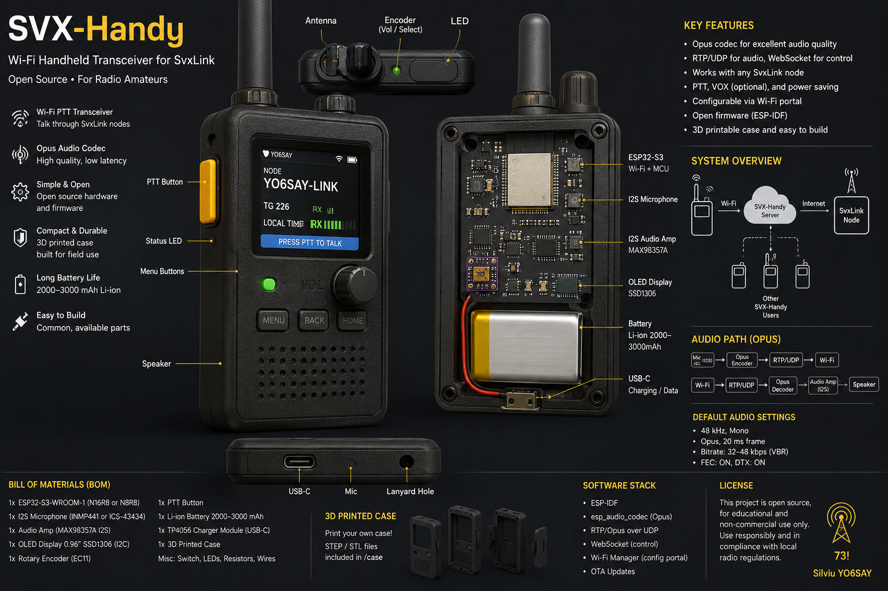

# SVX-Talkie

**A small 3D-printable Wi-Fi PTT handheld for SvxLink radioamateur nodes.**

SVX-Talkie is a simple handheld terminal that looks and feels like a small radio, but sends and receives audio over Wi-Fi to a SvxLink node.

It is intended as an open, non-commercial radioamateur project for people who want a physical PTT device instead of using an Android POC app.

Author: **Silviu YO6SAY**


---

## What it does

SVX-Talkie captures microphone audio, encodes it with Opus, sends it over Wi-Fi, and plays received audio through a small speaker.

The actual radio node remains SvxLink running on Linux.

```text
[SVX-Handy]
ESP32-S3 + mic + speaker + PTT
        |
        | Wi-Fi
        | RTP/UDP Opus audio
        | WebSocket/HTTPS control
        v
[SVX-Handy server / node agent]
        |
        v
[SvxLink on Linux]
        |
        v
[Radio / EchoLink / SvxReflector]
```

The handheld itself is **not** a VHF/UHF transmitter.  
It is a network audio/PTT terminal for a properly controlled SvxLink amateur-radio node.

---

## Goals

- Cheap and easy to build.
- 3D-printable handheld enclosure.
- Physical PTT button.
- Good voice quality using Opus.
- Simple Wi-Fi connectivity.
- Easy integration with SvxLink.
- Friendly enough for other radioamateurs to reproduce.

---

## Non-goals

This project is not:

- an Android replacement with a full app ecosystem;
- a WebRTC device;
- a SIP phone;
- a Mumble client;
- a LoRa voice radio;
- a complete SvxLink implementation on ESP32;
- a commercial product.

The goal is a reliable, understandable, radioamateur-friendly handheld.

---

## Recommended hardware

### Main controller

Use an **ESP32-S3 with PSRAM**.

Recommended for development:

```text
ESP32-S3-DevKitC-1-N16R8
```

Recommended for a custom PCB:

```text
ESP32-S3-WROOM-1U-N16R8
```

Why ESP32-S3:

- enough CPU for Opus;
- PSRAM support;
- Wi-Fi 2.4 GHz;
- I2S audio support;
- easy ESP-IDF development;
- widely available.

Avoid boards without PSRAM.

---

## Audio hardware

The easiest good-quality audio path is fully digital I2S.

### Microphone

Recommended simple prototype choice:

```text
ICS-43434 I2S microphone breakout
```

Alternative low-cost prototype choice:

```text
INMP441 I2S microphone breakout
```

Notes:

- I2S microphones are easier than analog microphones.
- Keep the microphone away from the speaker inside the enclosure.
- Use a small acoustic port and foam/wind protection.
- Final audio quality depends heavily on the enclosure, not only the microphone.

### Speaker amplifier

Recommended:

```text
MAX98357A I2S class-D mono amplifier
```

Why:

- I2S input;
- no I2C configuration needed;
- simple wiring;
- loud enough for a small handheld speaker;
- easy to find as a breakout module.

### Speaker

Recommended starting point:

```text
4 Ω / 3 W speaker, around 40 mm diameter
```

The exact speaker should be chosen after testing it inside the 3D-printed enclosure.

---

## Minimum BOM

For the first working prototype:

| Part | Recommended choice |
|---|---|
| MCU | ESP32-S3 DevKit with PSRAM |
| Microphone | ICS-43434 or INMP441 I2S mic |
| Audio amplifier | MAX98357A I2S mono amp |
| Speaker | 4 Ω / 3 W small speaker |
| PTT | Large momentary side button |
| Display | SSD1306 0.96 inch I2C OLED |
| Control | EC11 rotary encoder, optional |
| Battery | 1S Li-Ion / 18650, after bench testing |
| Case | 3D-printed PETG or ABS |

For early development, power the device from USB first.  
Do not debug battery charging and Opus audio at the same time.

---

## Suggested wiring

Use separate I2S input and output where possible.

```text
I2S microphone:
  BCLK  -> ESP32-S3 GPIO
  WS    -> ESP32-S3 GPIO
  DATA  -> ESP32-S3 GPIO
  VCC   -> 3.3 V
  GND   -> GND

I2S speaker amplifier:
  BCLK  -> ESP32-S3 GPIO
  LRC   -> ESP32-S3 GPIO
  DIN   -> ESP32-S3 GPIO
  VIN   -> 5 V preferred, or 3.3 V for lower volume
  GND   -> GND

PTT:
  one side -> GPIO with pull-up
  one side -> GND

OLED:
  SDA/SCL -> I2C GPIOs
  VCC     -> 3.3 V
  GND     -> GND
```

Example development pin map:

```c
#define PIN_I2S_MIC_BCLK    4
#define PIN_I2S_MIC_WS      5
#define PIN_I2S_MIC_DIN     6

#define PIN_I2S_SPK_BCLK    15
#define PIN_I2S_SPK_WS      16
#define PIN_I2S_SPK_DOUT    17

#define PIN_PTT             18

#define PIN_OLED_SDA        41
#define PIN_OLED_SCL        42
```

Before making a PCB, verify the pinout against the exact ESP32-S3 board or module being used.

---

## Audio format

Default audio profile:

```text
Codec:          Opus
Sample rate:    48 kHz
Channels:       mono
Frame size:     20 ms
Bitrate:        32-48 kbps
Mode:           VoIP
Transport:      RTP over UDP
```

Why Opus:

- very good voice quality;
- low latency;
- efficient bandwidth usage;
- suitable for interactive audio;
- supported by existing open-source tools and libraries.

---

## Firmware

Recommended firmware stack:

```text
ESP-IDF
esp_audio_codec
I2S driver
Wi-Fi
RTP/UDP audio transport
WebSocket/HTTPS control
```

Do not use Arduino IDE for the main firmware unless you only want a quick experiment.  
ESP-IDF gives better control over I2S, Wi-Fi, tasks, memory, and debugging.

### Firmware audio path

Transmit path:

```text
I2S microphone
  -> audio frame
  -> Opus encoder
  -> RTP packet
  -> UDP send
```

Receive path:

```text
UDP receive
  -> RTP packet check
  -> jitter buffer
  -> Opus decoder
  -> I2S speaker output
```

### Important firmware rules

- Do not allocate memory in the real-time audio loop.
- Do not use JSON in the audio path.
- Do not update the display from the audio task.
- Do not send audio over TCP.
- Keep the audio path simple and predictable.
- Add a jitter buffer for received audio.

---

## Server / node agent

The project needs a small server or node agent between the handheld and SvxLink.

For a simple first implementation:

```text
SVX-Talkie handheld
        |
        | Opus over UDP
        v
Node agent on Linux/Raspberry Pi
        |
        | PCM audio / virtual audio device
        v
SvxLink
```

The node agent should handle:

- device connection;
- PTT state;
- Opus decode/encode;
- audio bridge to SvxLink;
- TX timeout;
- reconnect logic;
- basic authentication.

For the first version, do not modify SvxLink itself.  
Use an external agent and connect audio through ALSA/PipeWire or another simple Linux audio bridge.

---

## Suggested repository layout

```text
.
├── README.md
├── firmware/
│   ├── main/
│   │   ├── app_main.c
│   │   ├── audio_i2s.c
│   │   ├── audio_opus.c
│   │   ├── rtp.c
│   │   ├── jitter_buffer.c
│   │   ├── ptt.c
│   │   └── ui_oled.c
│   └── sdkconfig.defaults
├── agent/
│   ├── README.md
│   └── src/
├── hardware/
│   ├── wiring/
│   └── bom/
├── enclosure/
│   └── stl/
└── docs/
    ├── protocol.md
    ├── audio-testing.md
    └── svxlink-setup.md
```

---

## Development milestones

### 1. Basic hardware test

Pass criteria:

- ESP32-S3 boots;
- OLED works;
- PTT button works;
- microphone produces audio samples;
- speaker plays a test tone.

### 2. Local Opus test

Pass criteria:

- microphone audio is encoded with Opus;
- Opus audio can be decoded back;
- no watchdog resets;
- no audio underruns.

### 3. Wi-Fi audio test

Pass criteria:

- handheld sends Opus packets to a Linux machine;
- Linux machine can decode and record the audio;
- Linux machine sends Opus audio back;
- handheld plays received audio.

### 4. SvxLink integration

Pass criteria:

- PTT from handheld activates the node agent;
- audio from handheld reaches SvxLink;
- received SvxLink audio plays on the handheld;
- TX timeout works.

### 5. Enclosure test

Pass criteria:

- PTT is comfortable;
- speaker is loud enough;
- microphone audio is clear;
- no strong acoustic feedback;
- Wi-Fi range is acceptable;
- battery operation is stable.

---

## Audio testing checklist

Record and compare audio samples for:

- quiet room noise;
- normal speech at 10 cm;
- normal speech at 30 cm;
- loud speech;
- outdoor wind/noise;
- speaker playback inside the enclosure;
- packet loss simulation;
- Wi-Fi weak signal test.

Do not judge audio quality only by listening live.  
Always record samples at the node side.

---

## Enclosure notes

The enclosure matters a lot.

Recommendations:

- use PETG or ABS for field prototypes;
- use PLA only for desk prototypes;
- keep the microphone away from the speaker;
- avoid placing the Wi-Fi antenna behind the battery;
- give the speaker a proper grille;
- protect the microphone port with acoustic mesh or foam;
- make the PTT button large and easy to press.

---

## Amateur-radio notes

SVX-Talkie is only a Wi-Fi terminal.

When it controls a SvxLink node connected to RF, the node owner and operator are responsible for:

- correct callsign identification;
- legal remote control;
- TX timeout;
- local amateur-radio rules;
- preventing anonymous access;
- disabling the node if needed.

Do not allow unauthenticated public users to key a radio transmitter.

---

## Useful references

- ESP32-S3 DevKitC-1 documentation  
  https://docs.espressif.com/projects/esp-dev-kits/en/latest/esp32s3/esp32-s3-devkitc-1/index.html

- ESP32-S3 I2S documentation  
  https://docs.espressif.com/projects/esp-idf/en/stable/esp32s3/api-reference/peripherals/i2s.html

- Espressif ESP Audio Codec component  
  https://components.espressif.com/components/espressif/esp_audio_codec

- Opus codec, RFC 6716  
  https://www.rfc-editor.org/rfc/rfc6716.html

- RTP payload for Opus, RFC 7587  
  https://datatracker.ietf.org/doc/html/rfc7587

- SvxLink  
  https://www.svxlink.org/

- MAX98357A I2S amplifier  
  https://www.analog.com/media/en/technical-documentation/data-sheets/max98357a-max98357b.pdf

---

## Project author

Made for the radioamateur community by:

**Silviu YO6SAY**

73!
